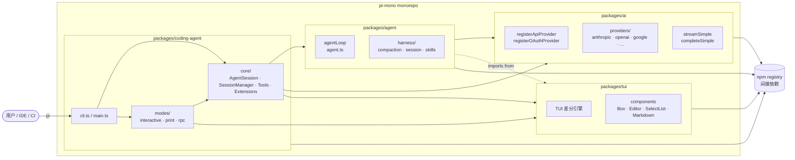
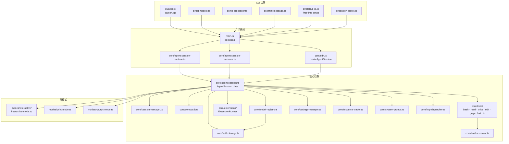
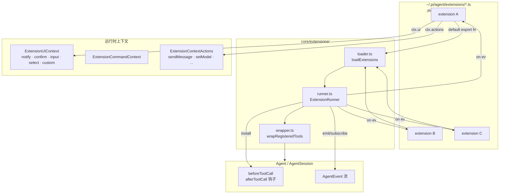
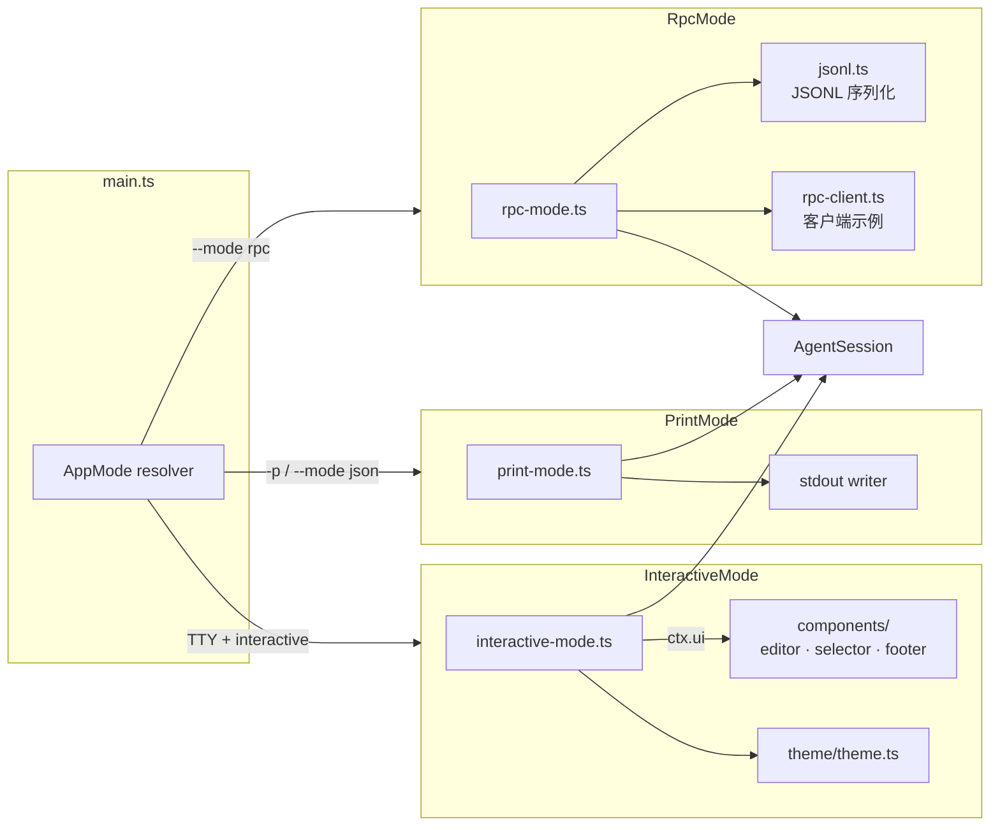
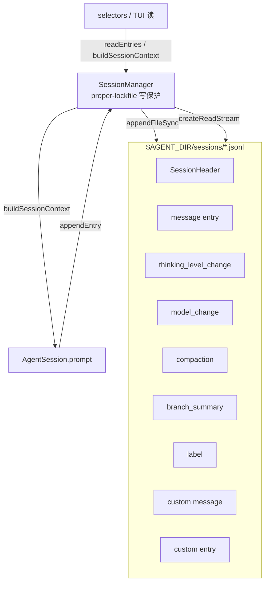
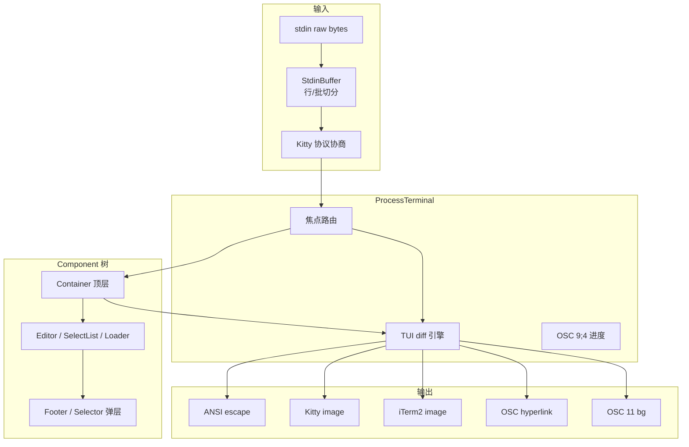
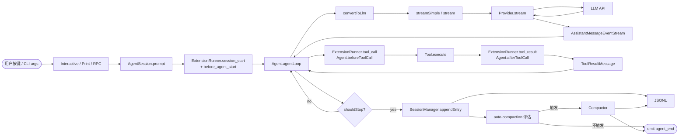

# 70 · 模块架构图 (Module Architecture)

> 模块级别的分层与依赖关系。所有图均用 Mermaid 描述，可在支持 Mermaid 的 Markdown 渲染器（VSCode、GitHub、Obsidian 等）直接查看。

## 1. 全局包依赖图（最粗粒度）



**不变方向**：`pi-coding-agent` 可以依赖其它三包；`pi-agent-core` 只能依赖 `pi-ai`；`pi-tui` 独立；`pi-ai` 独立。**无环**。

## 2. `pi-coding-agent` 内部分层



`AgentSession`（L2）是枢纽：被三个模式共享；被 CLI / SDK 间接持有；L2 内所有子系统只对 `AgentSession` 暴露 `addEventListener` / 方法调用。

## 3. 扩展系统架构



**关键不变量**：

- 每个扩展 = 一个 `ExtensionFactory = (pi: ExtensionAPI) => void | Promise<void>`
- `ExtensionAPI` 是 Loader 注入的"自我描述"接口：扩展只能调用 `pi.xxx`，不能直接 `import` 内部模块
- 钩子触发顺序：`session_start` → `agent_start` → `turn_start` → `message_start` → `message_update*` → `message_end` → （`tool_call` → `tool_execution_*` → `tool_result`）* → `turn_end` → `agent_end` → `session_shutdown`

## 4. 资源加载架构

```mermaid
graph LR
    subgraph SRC[来源]
        S1[~/.pi/agent/]
        S2[.pi/ project local]
        S3[git URLs via<br/>pi package install]
    end

    subgraph LOADER[ResourceLoader]
        L1[loadExtensions]
        L2[loadSkills]
        L3[loadPromptTemplates]
        L4[loadThemes]
        L5[loadAgentsFiles<br/>AGENTS.md / CLAUDE.md]
    end

    subgraph REG[Registry]
        R1[ExtensionRunner]
        R2[Skill[]<br/>formatSkillsForPrompt]
        R3[PromptTemplate[]]
        R4[Theme[]<br/>selected via /theme]
        R5[ContextFile[]<br/>attached to systemPrompt]
    end

    S1 --> L1
    S2 --> L1
    S3 --> L1
    S1 --> L2
    S2 --> L2
    S3 --> L2
    S1 --> L3
    S2 --> L3
    S3 --> L3
    S1 --> L4
    S2 --> L4
    S3 --> L4
    S1 --> L5
    S2 --> L5
    L1 --> R1
    L2 --> R2
    L3 --> R3
    L4 --> R4
    L5 --> R5
    R2 --> SYSP[system-prompt.ts]
    R5 --> SYSP
    R3 --> R3B[prompt-templates.ts<br/>expandPromptTemplate]
```

**优先级**：项目级 (`.pi/`) 覆盖全局级 (`~/.pi/agent/`)；同名资源后者赢（按 `sourceInfo` 标记 `user` / `project` / `package`）。

## 5. Provider 系统架构

```mermaid
graph TB
    subgraph USER[User 视角]
        U1[--provider / --model]
        U2[/login OAuth]
        U3[auth.json]
        U4[环境变量]
    end

    subgraph REG[ModelRegistry]
        M1[built-in MODELS<br/>from pi-ai]
        M2[用户自定义 providers<br/>registerProvider / config]
        M3[resolveCliModel]
        M4[getApiKeyAndHeaders]
    end

    subgraph PI_AI[pi-ai]
        P1[streamSimple]
        P2[registerApiProvider]
        P3[registerOAuthProvider]
        P4[providers/<br/>anthropic · openai · ...]
    end

    subgraph EXT[扩展点]
        EX1[pi.registerProvider]
        EX2[pi.registerProvider oauth]
    end

    U1 --> M3
    U2 --> M3
    U3 --> M4
    U4 --> M4
    M1 --> M3
    M2 --> M3
    M3 --> P1
    P1 --> P4
    M4 --> P1
    EX1 --> M2
    EX1 --> P2
    EX2 --> P3
    P2 --> P4
    P3 --> M4
```

## 6. 三种运行模式架构



**`AgentSession` 是三种模式共享的枢纽**；差异完全在 I/O 层。

## 7. 持久化架构



**格式版本**：`CURRENT_SESSION_VERSION = 3`，旧版本由 `migrations.ts` 自动迁移。

## 8. TUI 渲染栈



## 9. 数据流总览（一次完整 prompt）


