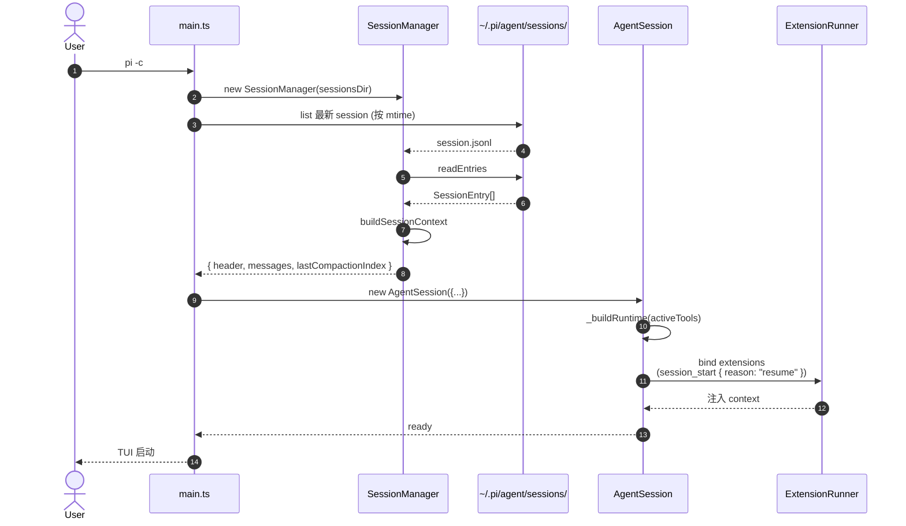
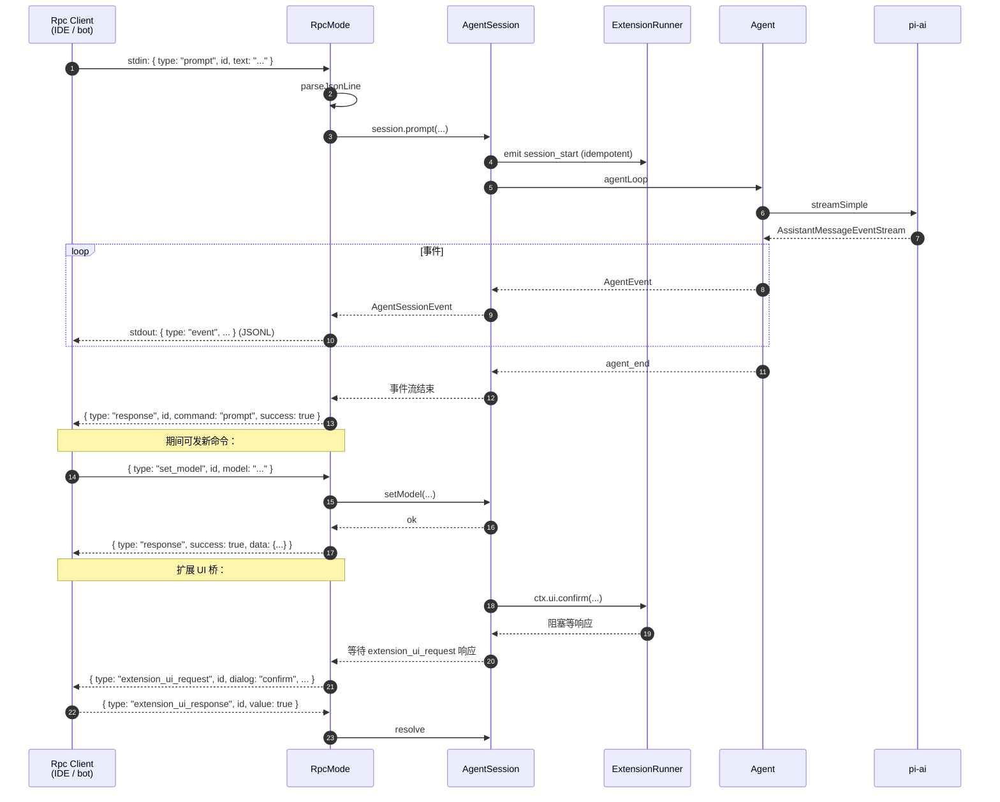
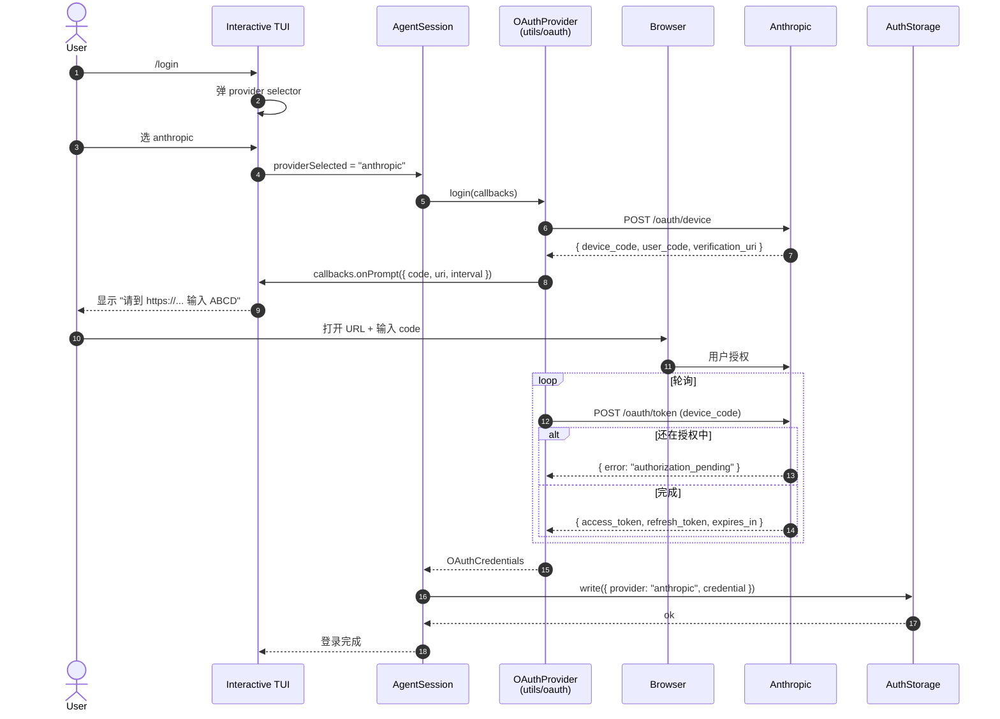
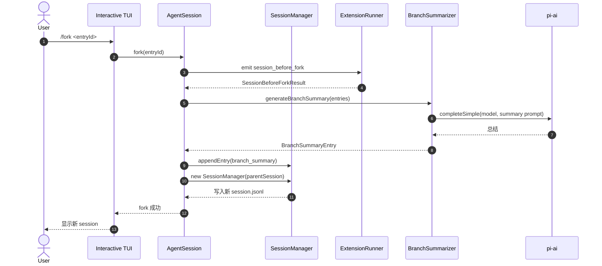
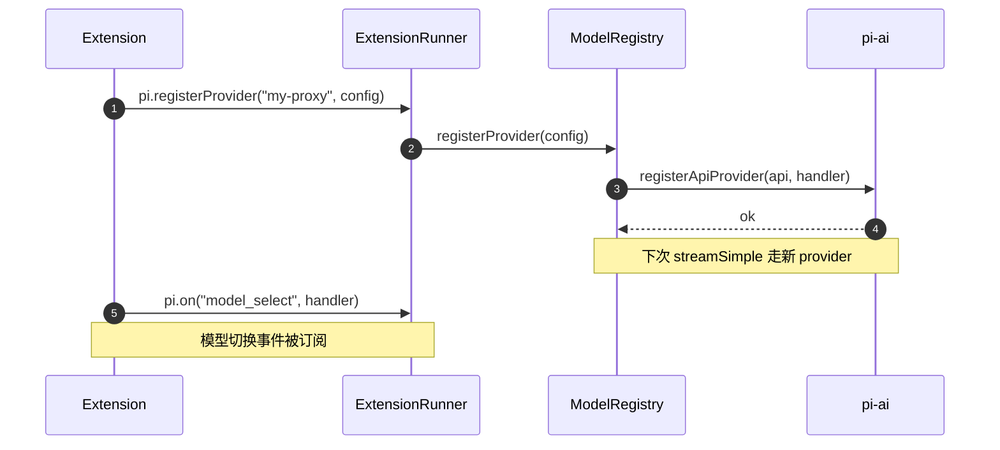
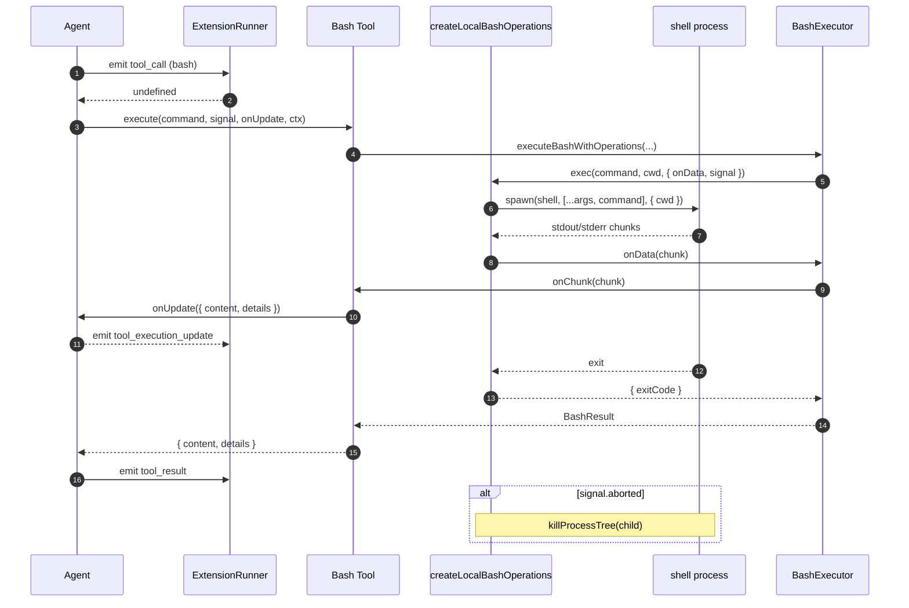
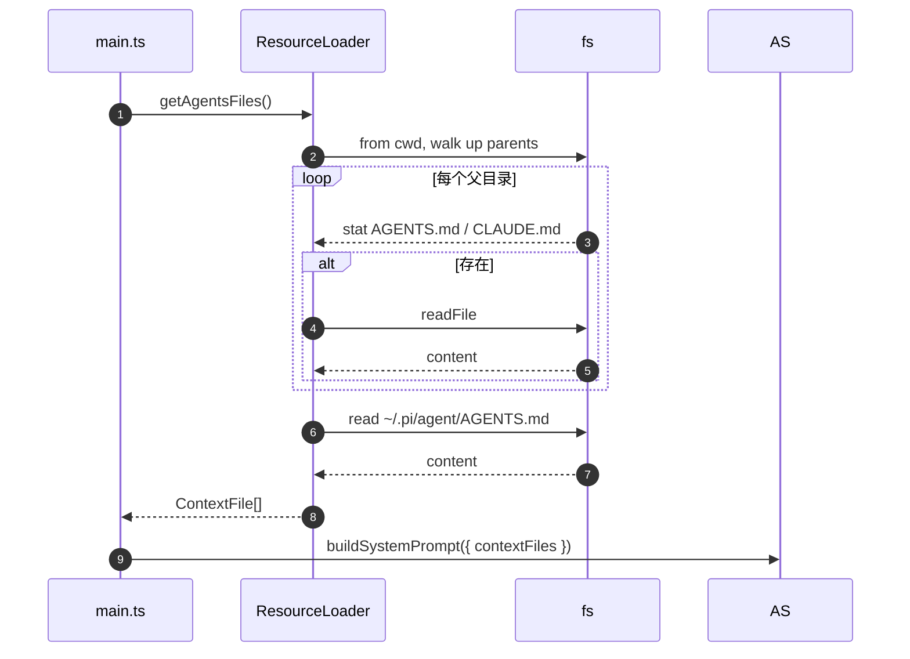

# 80 · 模块间时序图 (Sequence Diagrams)

> 关键跨模块流程的时序图。Mermaid `sequenceDiagram` 语法。

## 1. 交互模式：单次用户 prompt 完整生命周期

```mermaid
sequenceDiagram
    autonumber
    actor U as User
    participant TUI as Interactive TUI<br/>(modes/interactive)
    participant AS as AgentSession
    participant EX as ExtensionRunner
    participant AG as Agent<br/>(agent-core)
    participant SM as SessionManager
    participant MR as ModelRegistry
    participant AI as pi-ai<br/>(streamSimple)
    participant PR as Provider<br/>(anthropic.ts)
    participant T as Tool<br/>(bash/read/...)

    U->>TUI: 按 Enter (multiline text)
    TUI->>AS: prompt(messages, options)
    AS->>EX: emit session_start / before_agent_start
    EX-->>AS: 注入 extra prompt / 工具
    AS->>SM: appendEntry(message)
    AS->>AG: agentLoop(prompts, ctx, config)
    AG->>MR: getApiKeyAndHeaders(model)
    MR-->>AG: { apiKey, headers }
    AG->>AI: streamSimple(model, ctx, opts)
    AI->>PR: provider.stream(model, ctx, opts)
    PR-->>AI: AssistantMessageEventStream
    AI-->>AG: AssistantMessageEventStream

    loop 每个事件
        AG-->>AS: AgentEvent<br/>(turn_start / message_start / delta / end)
        AS->>EX: emit (逐事件)
        AS->>TUI: 事件订阅者渲染
    end

    alt assistant 发出 tool_call
        AG->>EX: emit tool_call
        EX-->>AG: { block? } or undefined
        alt 未 block
            AG->>T: execute(toolCall, args)
            T-->>AG: AgentToolResult
            AG->>EX: emit tool_result
            EX-->>AG: AfterToolCallResult (字段级覆盖)
        else block
            AG: 构造 error tool result
        end
        AG->>AS: emit tool_execution_end
        AS->>SM: appendEntry(tool_result)
        AS->>AG: 继续循环
    end

    AG-->>AS: agent_end
    AS->>EX: emit agent_end
    AS-->>TUI: 事件已发完
    TUI-->>U: 渲染
```

**关键不变量**：
- `AgentSession` 负责把 `AgentEvent` 落到 SessionManager 与 TUI；Agent 本身不知道 TUI 存在。
- Extension 的 `before_agent_start` 可修改 prompt，但**不能修改 model**；改 model 走 `setModel`。
- 任何 Provider 必须返回 stream，**不得抛**。

## 2. 扩展拦截工具调用（before/after hook）

```mermaid
sequenceDiagram
    autonumber
    participant AG as Agent (agentLoop)
    participant AS as AgentSession
    participant EX as ExtensionRunner
    participant T as Tool
    participant LLM as 客户端扩展<br/>(permission gate 例子)

    AG->>AS: 准备执行 toolCall
    AS->>AS: agent.beforeToolCall 已安装
    AS->>EX: emitToolCall(event)
    EX->>LLM: handler(event, ctx)
    LLM-->>EX: ctx.ui.confirm("Allow rm -rf?")
    Note over EX,LLM: ctx.ui 弹 TUI 对话框
    LLM-->>EX: false (用户拒绝)
    EX-->>AS: { block: true, reason: "Blocked by user" }
    AS-->>AG: 返回 { block: true }
    AG: 构造 error tool result<br/>(reason 填入 text)
    AG: 继续主循环

    alt 允许
        EX-->>AS: undefined
        AS-->>AG: 继续
        AG->>T: execute(toolCall, args)
        T-->>AG: AgentToolResult
        AG->>AS: agent.afterToolCall
        AS->>EX: emitToolResult(event)
        EX->>LLM: handler(event, ctx)
        LLM-->>EX: AfterToolCallResult { details, ... }
        EX-->>AS: AfterToolCallResult
        AS-->>AG: 覆盖字段
        AG: 继续主循环
    end
```

**字段级覆盖**：`AfterToolCallResult` 的 `content` / `details` / `isError` 各自独立替换，**不做深合并**。

## 3. 自动 Compaction 触发

```mermaid
sequenceDiagram
    autonumber
    participant AS as AgentSession
    participant AG as Agent
    participant SM as SessionManager
    participant CMP as Compactor
    participant AI as pi-ai
    participant EX as ExtensionRunner

    Note over AS: assistant 消息结束
    AS->>AS: 计算 context tokens<br/>(estimateContextTokens)
    AS->>AS: shouldCompact(ctx, settings)
    alt token > reserveTokens + keepRecentTokens
        AS->>EX: emit session_before_compact
        EX-->>AS: SessionBeforeCompactResult?
        AS->>CMP: prepareCompaction / findCutPoint
        CMP-->>AS: { messagesToKeep, messagesToSummarize }
        AS->>AI: completeSimple(model, summary prompt)
        AI-->>AS: 总结 AssistantMessage
        AS->>CMP: 生成 CompactionEntry<br/>(含 file ops 列表)
        AS->>SM: appendEntry(compaction)
        AS->>SM: 重新加载 session
        AS->>EX: emit session_compact
    else 未触发
        AS: 正常结束
    end
```

**Overflow 触发**（同流程但起点不同）：LLM 报错 → `isContextOverflow` → 走相同路径，但不调 LLM 总结，直接 truncate + 标 "overflow" 原因。

## 4. Session 续接（`-c` / `--resume`）



## 5. RPC 模式：客户端命令



**协议约束**：stdin/stdout 都是 JSONL（一行一个 JSON 对象）；事件可乱序到达，但 `id` 用来关联 command ↔ response。

## 6. OAuth 登录（以 Claude 为例）



## 7. `/fork` 创建分支 session



## 8. 自定义 Provider（扩展点）



## 9. Bash 工具执行（流式 + 取消）



**可替换后端**：`BashOperations.exec` 是接口；`createLocalBashOperations` 是默认实现。SSH / 容器 / 沙箱可注入自己的 `exec`。

## 10. 上下文文件加载（AGENTS.md 向上找根）


